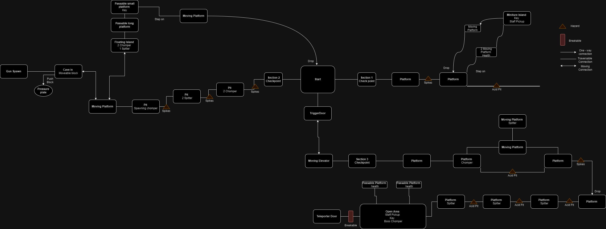
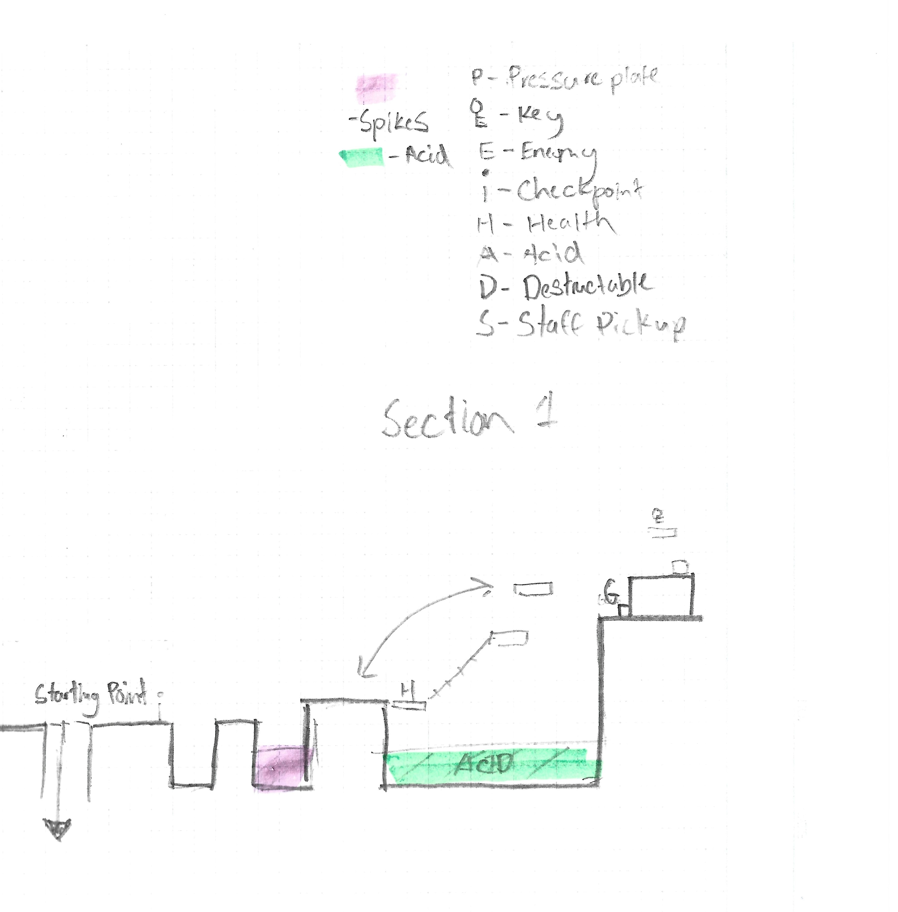
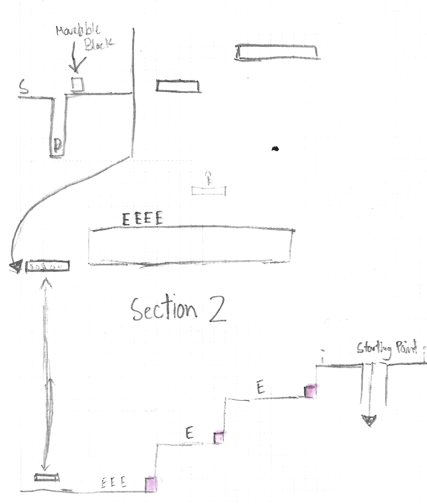
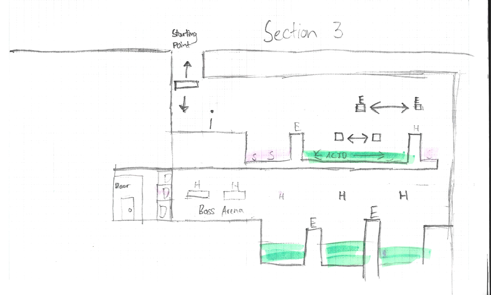

# COMP2150  - Level Design Document
### Name: Brynel Santos
### Student number: 46602097

This document discusses and reflects on the design of your platformer level for the Level Design assessment. It should be 1500 words. Make sure you delete this and all other instructional text throughout the document before checking your word count prior to submission. Hint: You can check word count by copying this text into a Word or Google doc.

Your document must include images. To insert an image into your documentation, place it in the "DocImages" folder in this repo, then place the below text where you want the image to appear:

```

```

Example:


## 1. Player Experience (~700 words)
#### ***Outline and justify how your level design facilitates the core player experience goals outlined in the assignment spec. Each section should be supported by specific examples and screenshots of your game encounters that highlight design choices made to facilitate that particular experience.***
  
The vision, objectives, mechanics, and features of a video game are all outlined in detail in a game design plan. It includes specifics like the plot, the characters, the gaming mechanics,  
the level design, the visual style, and the audio.  
For the development team, the plan acts as a blueprint, directing the production process from conception to completion and guaranteeing a seamless and captivating player experience. 

### 1.1. Discovery  
##### ***What does the player learn? How does your encounter and broader level design facilitate learning in a way that follows good design practice?*** 

Throughout the game, players will discovery that Section 1 and 2 are both introducing the encounters that will help them traverse through especially during section 3. 
The game is calibrated to where the encounters are slowly eased into rather putting them on the spot. 
Players will learn how to platform between blocks and learn how to dodge enemies on the go, while also allowing them to freely discover any techniques or actions that 
will help them finish the level. 
 
For Example: 
In section 1, the player will encounter a simple platform area that showcases the different hazards and jumps that players will need to make 
 
 
Later on in Section 2, if the player obtained the staff, when they encounter their first enemies they will be able to use the staff to easily traverse it. However, if the players 
do not explore, it will help them learn and understand that exploration is key themes for this game. 
 


### 1.2. Drama
### ***What is the intensity curve? How does your design facilitate increasing yet modulating intensity, with moments of tension and relief?*** 
Drama can create a sense of intensity that is modulated according to the situation at hand. 
For this game, drama is created to teach the player the various encounters and slowly ease them to the intensity that will await them 
as they progress through each section. 
Section 1 has a mild intensity with the environment hazards as the one of the aspects applying pressure while the moving platforms will act as the 
intensifier as the player navigate through the section.

For example:   

 
 
Section 2 delves a bit more pressure with the introduction to enemy encounters, showcasing both the chomper and spitter enemies in the being and slowly adding  
more variety as the player goes through the section. Spikes are also added to provide a mild intensifier for the player in order to keep them in their toes. The cave-in and the moving platforms are used to 
relieve the players of the tension in order to give them room to understand the situation.
 
For example: 

 

Lastly Section 3 gives the player a high amount of intensity with moments of relief, passing through each obstacle and having areas that will relieve the stress. 
The checkpoint section is a relief area that players can use to assess the situation before attempting the obstacles. When the players drop down from the first area, 
they are greeted with more obstacles and enemies, while they are just out of the area that the spitters can attack them. Finally, the intensity of the game is at its highest 
when it faces the last enemy as it is stronger compared to the other enemies in the game, there are platforms that the boss cannot reach with health-packs, so they can continue with the fight.
 
For example: 

  

### 1.3. Challenge
### ***What are the main challenges? How have you designed and balanced these challenges to control the difficulty curve and keep the player in the flow channel?***
Challenge refers to the difficulty and complexity that is presented to the player when they first enter the game. 
For this game, it has been calibrated each section to slowly increase the difficulty, which each challenge being a checkpoint of the players' skill. 
In the first section the challenge presented to the player is platforming, with each part of the parkour slowly increasing in difficulty without fully putting the player
into the deep end. 
 
For example:    

  

This showcases the basic challenges that the player will encounter, focusing more on the ability of the player to jump and navigate through each platforms 
 
   

This section challenges players with their ability to dodge and handle enemies, if players have weapons it reduces the pressure and challenge for them. However, 
if players do section 2 first, they will struggle. 
 
 
 
Section 3 combines the aspect of section 1 and 2, challenging players with their ability to parkour and defeat enemies, navigating through various chompers and spitters while jumping over hazards. 
It is finalised with a boss battle with a large chomper.

### 1.4. Exploration
### ***How does your level design facilitate autonomy and invite the player to explore? How do your aesthetic and layout choices create distinct and memorable spaces and/or places?***
Exploration is the traversal aspect of games that allows players to have a sense investigation of the environment, finding secrets or routes not found through automation, 
For this game, exploration is one of main aspects that players will use to discover secrets and powers that will help them progress through. 
Making the game a non-linear experience allows players to try different routes, testing which provides the fastest clear-time or have the best rewards. Each section 
is unique and have different encounters that not only challenges players to navigate through it, but each layout will help create a distinct environment that has memorable landmarks, allowing players 
to replay and memorize. 

Section 1 contains a simplistic layout with mild hazards such as the acid and spike pits, moving platforms are also present to give players a form of parkour. At the end of this section, players are rewarded with a  
key and staff pickup

  
 
Section 2 contains a bit more complex layout that has multiple enemy encounters and mild amount of environmental hazards. Through exploration, players can find a cave-in that contains rewards such as a gun pickup and health-kits 
while there and important mechanism that will unlock the section 3. However, there is a destructable wall that can only be broken using a staff, teaching players to explore more.
 
   
 
Section 3 is the more complex layout compared to the other sections as this combines both aspects of those sections, however it has the least amount of exploration for rewards as it test players 
of their skill and ability to navigate through each obstacle. 
 
 
 


## 2. Core Gameplay (~400 words)
A section on Core Gameplay, where storyboards are used to outline how you introduce the player to each of the required gameplay elements in the first section of the game. Storyboards should follow the format provided in lectures.
Storyboards can be combined when multiple mechanics are introduced within a single encounter. Each section should include a sentence or two to briefly justify why you chose to introduce the mechanic/s to the player in that sequence.
You should restructure the headings below to match the order they appear in your level.
 
The core gameplay showcases the mechanics that will be introduced to the player, these mechanics will determine 
how a game will operate and how a player shall react to encounters. 
 
### 2.1. Checkpoints 
Checkpoints are used as markers of the players progress, for this game the checkpoints are set quite early into the level to give 
each section a sense of non-linear progression, allowing them to pick which section to attempt. However, for section 3, it goes back to  the traditional marker. 
  
This showcases the first time that the player will gain the checkpoints, with both checkpoints indicating which areas need to be explored. 

### 2.2. Spikes 
Spikes are used as an environmental hazards for the players to avoid. 
 
 
 
This showcases the players first encounter with the spikes, it is a basic jump and used to give players a slight challenge 
and insight to what's to come. In this storyboard it also showcases what would happen if a player falls in and dies. 
 
  
 
This showcases what is the correct solution in this encounter, by properly jumping over the obstacle.

### 2.3. Acid 
The Acid is introduced in Section 1 of the game, it is used as an environmental hazards that will damage and reset 
the player back to the recent checkpoint. It can give a player a sense of danger and caution. 
 
  
This showcases the first interaction Acid pit, when the player falls in they will lose a heart and respawn to the nearest checkpoint. However, 
if players manage to complete the jump, they are able to get a health pack and continue with the level. 
 
### 2.4. Moving Platforms 
Moving platforms can be used to traverse any entity to different locations.  
  

This section shows the first encounter with the moving platform, and the consequences in failing the jump.  
 
### 2.5. Health Pickups 
Health pickups are introduced later in section 1 to make sure that the player does not have a game-over early into the level.  

  

Access to the first health kits is quite simple and it is to ensure that the player does not lose too much health especially when traversing through the platforms. 

### 2.6. Keys 
These keys are used to open the teleport door at the end of the game, it is first shown on section 1 as shown on the storyboard.
   
This showcases the first encounter of the key, through parkour, players are able to gain this. 
It is also in the same location as the staff pickup in order to provide the player a reward for completing  
the section as they traverse through the acid pits and moving platforms. 
 
### 2.7. Weapon Pickup (Staff) 
The staff is the first weapon that players will obtain.  

    

This is the first encounter of the staff, it is in the same location as the key to provide players 
a reward for completing a section of the level. They will acquire this my navigating through the  
moving platform and acid pits.


### 2.8. Chompers 
Chompers appear on section 2 of the level and is introduced as the first encounter and training for the players.  

   

Players wil first encounter this enemy at the beginning of the section 2, showcasing if the player will attempt to maneuver around chompers however they fail.  

  

Now when the player respawn if they understand what they need to do or have the staff, they will be more equipped with the knowledge to navigate through the encounter.

### 2.9. Spitters 
Spitters similar to chompers are introduced on section 2 as a basic encounter, they either avoid or take on them head-on  
 
  
Similar to the chomper encounter, players will need to decide whether they will avoid engaging with the spitter and dodging their attacks or
attack them using a weapon, in this storyboard it showcases the consequences of dying to the enemy, respawning back in checkpoint 2 
 
   

This showcases what will happen if the player attacks the enemy, eliminating them from the game or dodging them using various means.

### 2.10. Passthrough Platforms 
Passthrough platforms can provide a sense of parkour as well as exploration.  
 


### 2.11. Weapon Pickup (Gun) 
The gun is introduced when the player access the cave-in in section 2 
 
   
The gun is in a cave-in around section 2, the access this through the moving platform. 
 
    
This showcases the inside of the cave-in, with a minor obstacle the player is able to gain the weapon.


## 3. Spatiotemporal Design
A section on Spatiotemporal Design, which includes your molecule diagram and annotated level maps (one for each main section of your level). These diagrams may be made digitally or by hand, but must not be created from screenshots of your game. The annotated level maps should show the structure you intend to build, included game elements, and the path the player is expected to take through the level. Examples of these diagrams are included in the level design lectures.

No additional words are necessary for this section (any words should only be within your images/diagrams).
 
### 3.1. Molecule Diagram 
    

### 3.2. Level Map – Section 1 

     

### 3.3.	Level Map – Section 2  

    

### 3.4.	Level Map – Section 3 
 
    

## 4. Iterative Design (~400 words)
*Reflect on how iterative design helped to improve your level.*
 
Iterative design is the  

#### ***Additional Storyboards***
  
  
 
#### ***Changes in unity*** 
 
#### ***Further reflective on Iterative Design***


## Generative AI Use Acknowledgement

Uheory mentioned, however, was useful, and I've incorporated it into my work.

### Tool Used: Example
**Nature of Use** Example Text

**Evidence Attached?** Example Text

**Additional Notes:** Example Text


